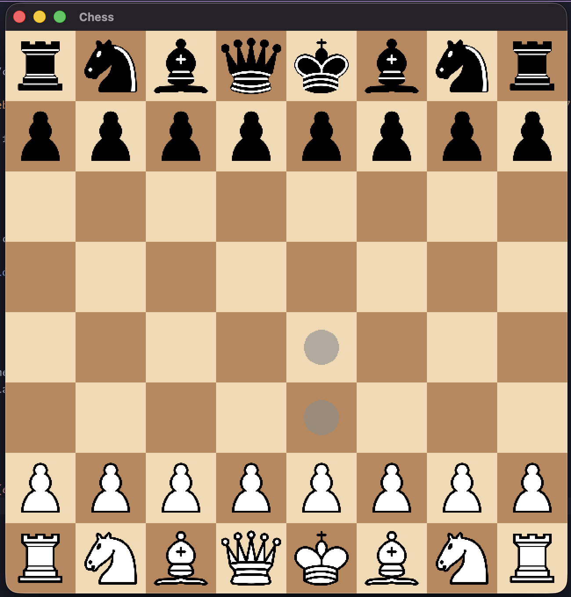

# Chess

A simple two-player chess game written in **C++** using **SFML 3.0** for rendering.
Press **`ESC`** during gameplay to open the pause menu.

---

## Screenshot




---

## Roadmap

Planned improvements (in no particular order):

- [ ] Add a proper pawn promotion menu
- [ ] Improve code readability
- [ ] Enhance the look and feel of the menus
- [ ] Refactor certain sections for better efficiency

---

## Building and Running

### Using CMake (recommended)

1. Create and enter a build directory:
   ```bash
   mkdir build
   cd build
   ```

2. Generate build files and compile the project:
   ```bash
   cmake ..
   cmake --build .
   ```

3. Run the program from the project root:
   ```bash
   cd ..
   ./build/bin/chess
   ```

4. After making changes, rebuild and run with:
   ```bash
   cmake --build build && ./build/bin/chess
   ```

---

### Building with g++ / clang++

If you prefer to compile manually, run:
```bash
clang++ src/*.cpp -I/opt/homebrew/include -L/opt/homebrew/lib \
-lsfml-graphics -lsfml-window -lsfml-system -std=c++17 -o chess
```

Then execute:
```bash
./chess
```
